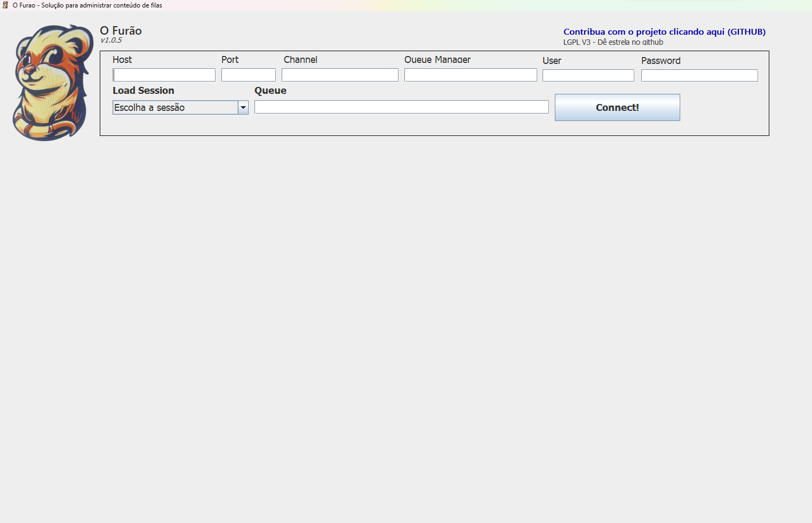
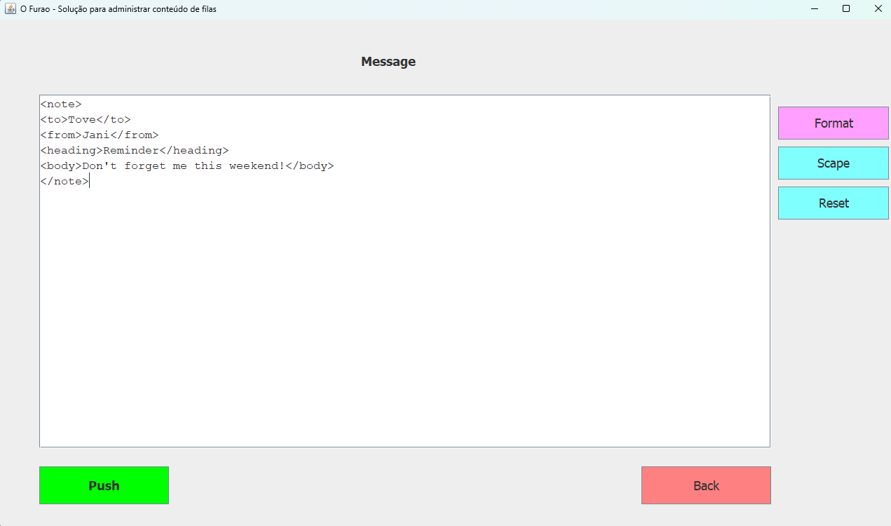

 

 <a href="./O Furao MQ v1.0.5.jar">
 Download JAR</a>

<h3 align="center">O Furão MQ - Software utilitário para administração de mensagens em filas MQ</h3>
<h3 align="center">Atualmente funcional para a plataforma IBM MQ</h3>

 
 

ON ROCK!! :metal:

## Stack :mortar_board:

- [Java](https://www.java.com/) - Java

## Agradecimentos :sparkling_heart:

- [Eclipse](https://www.eclipse.org/)
- [Bing IA Images](https://www.bing.com/images/create?cc=br)

